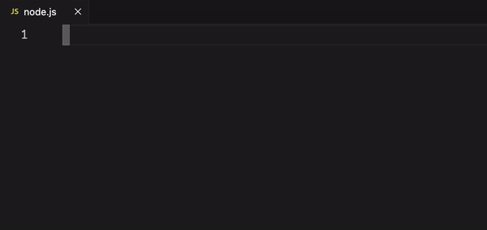

<p align="center">
    <p align="center">
        
    </p>
    <h1 align="center"><b>Open Payments SDK Snippets</b></h1>
    <p align="center">
        <b>Updated for Open Payments Node SDK version 6</b>
    </p>
    <br />
    <br />
    <p align="center">
        
    </p>
</p>

## Installation

1. Launch _Quick Open_:

    - Linux & Windows: `Ctrl+P`
    - macOS: `⌘+P`

2. Paste the following command and press `Enter`:

```shell
ext install open-payments-snippets-vscode
```

3. Choose the extension (make sure the author is `Interledger Foundation`).

4. Reload Visual Studio Code

## Usage

Every Open Payments SDK snippet starts with the "op-" prefix:

-   `op-pp`
-   `op-grant-continue`

You don't need to type any dashes or the full keyword. You can use some alternatives. For example:

-   `ogc` -> `op-grant-continue` snippet
-   `ograntc` -> `op-grant-continue` snippet

## Snippets

| Keyword            | Description                                            |
| ------------------ | ------------------------------------------------------ |
| op-uc              | Creates an unauthenticated OP client                   |
| op-ac              | Creates an authenticated OP client                     |
| op-wa              | Get wallet address information                         |
| op-wa-keys         | Get wallet address keys                                |
| op-grant-revoke    | Revoke a grant                                         |
| op-grant           | Request a grant                                        |
| op-grant-continue  | Continue a grant                                       |
| op-grant-ip        | Request an incoming payment grant                      |
| op-grant-op        | Request an outgoing payment grant                      |
| op-grant-quote     | Request a quote grant                                  |
| op-token-revoke    | Revoke a token                                         |
| op-token-rotate    | Rotate a token                                         |
| op-quote-create    | Create a quote without receive amount and debit amount |
| op-quote-create-ra | Create a quote with receive amount                     |
| op-quote-create-da | Create a quote with debit amount                       |
| op-quote-get       | Get a quote                                            |
| op-ip-create       | Create an incoming payment without incoming amount     |
| op-ip-create-ia    | Create an incoming payment with incoming amount        |
| op-ip-complete     | Complete an incoming payment                           |
| op-ip-get          | Get an incoming payment                                |
| op-ip-list         | List incoming payments                                 |
| op-op-create       | Create an outgoing payment                             |
| op-op-get          | Get an outgoing payment                                |
| op-op-list         | List outgoing payments                                 |

## Feedback and issues

If you encounter any issues or have feedback, please open an issue on
the [GitHub repository](https://github.com/interledger/open-payments-snippets-vscode/issues). We appreciate your feedback
and contributions!

## License

This project is licensed under the MIT License - see the [LICENSE](./LICENSE) file for details.
